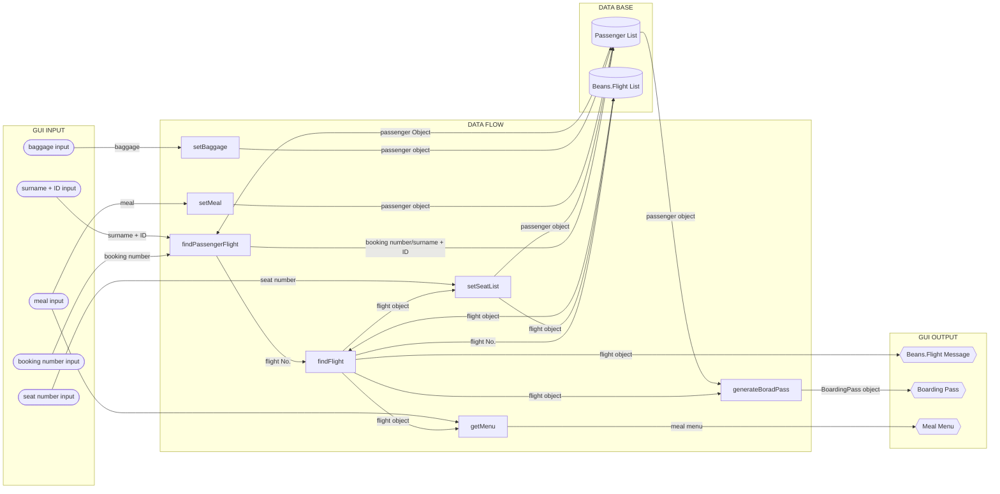

```mermaid
graph LR
    subgraph GUI INPUT
    A([booking number input])
    B([surname + ID input])
    C([seat number input])
    D([meal input])
    E([baggage input])
    end
    subgraph DATA FLOW
    F[findPassengerFlight]
    I[findFlight]
    J[setSeatList]
    K[getMenu]
    Q[setMeal]
    L[setBaggage]
    N[generateBoradPass]
    end
    subgraph DATA BASE
    G[(Passenger List)]
    M[(Beans.Flight List)]
    end
    subgraph GUI OUTPUT
    H{{Beans.Flight Message}}
    O{{Boarding Pass}}
    P{{Meal Menu}}
    end
    A -->|booking number| F
    B -->|surname + ID| F
    F -->|booking number/surname + ID| G
    G -->|passenger Object|F
    F -->|flight No.|I
    I -->|flight No.|M
    I -->|flight object|J
    I -->|flight object|K
    K -->|meal menu|P
    J -->|flight object|M
    J -->|passenger object|G
    M -->|flight object|I
    I -->|flight object|H
    C -->|seat number| J
    D -->|meal|Q
    Q -->|passenger object|G
    E -->|baggage|L
    L -->|passenger object|G
    I -->|flight object|N
    D -->K
    G -->|passenger object|N
    N -->|BoardingPass object|O
```
