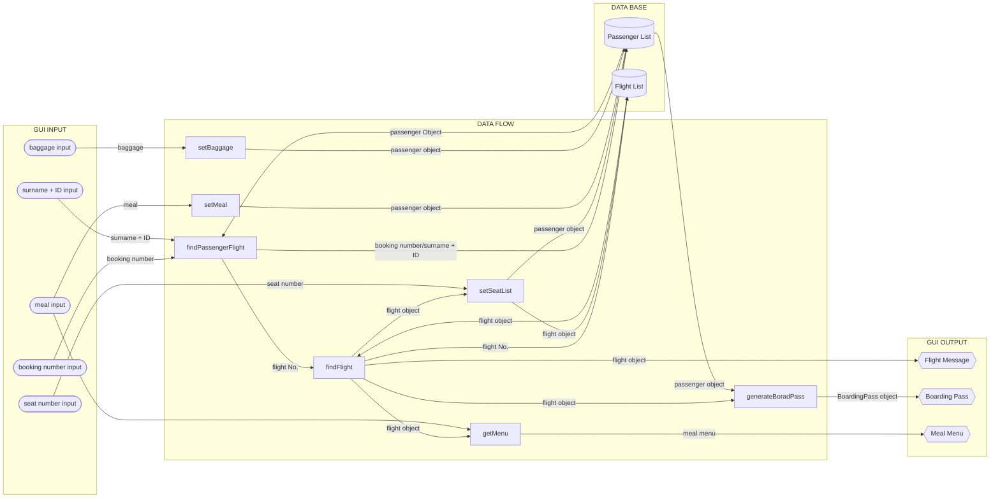

# EBU6304-2022-Software-Engineering-Group-8

#### Introduction
This is EBU6304 Software Engineering Coursework repository of Group 8

#### File Overview
```
Doc
src
└─main
    └─java
        ├─Flight
        ├─Passenger
        └─Tools
```

#### Software Structure
1. Backend System
2. Frontend System

#### How to run this project

1. Install `jdk1.8.0`
2. Import this project into `IDEA`
3. Go into `PassengerEnd.java` and run the `main` method

## iteration2 input/output



## Other Information
### Number of meetings held

We held three meetings, the agenda and minutes of the meeting were written in the journals of QMHub

### Cooperation

During the cooperation period, we used Tencent Conference for remote collaboration and sharing. At the same time, we achieved the effect of 1+1 greater than 2 according to the pair programming recommended in the Agile development specification.

### Member work evaluation

We all attended the meeting, and everyone contributed valuable input to Project at the meeting.

Thanks for all the contributions from each memebers throughout iteration 1.
